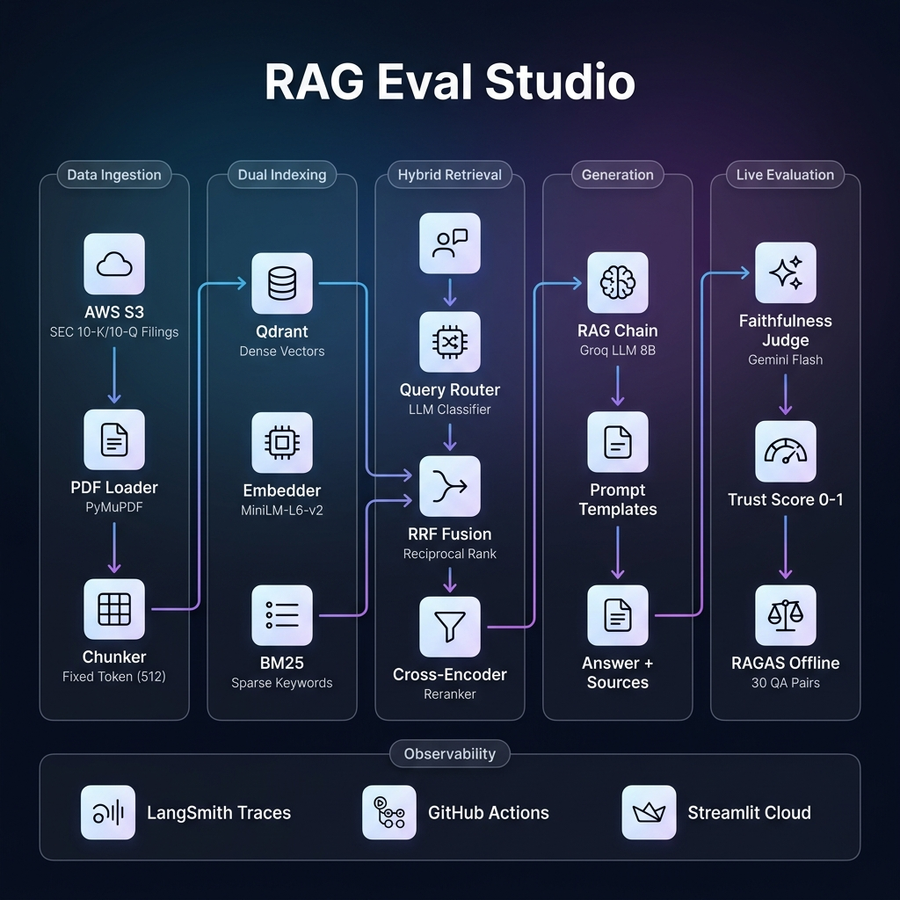

# RAG Eval Studio

> A production-grade Retrieval-Augmented Generation pipeline with hybrid search,
> cross-encoder reranking, real-time faithfulness scoring, and automated RAGAS evaluation.
> Built on SEC financial filings (10-K, 10-Q) stored in AWS S3.

---

## Key Features

- **Hybrid Retrieval** — Dense (Qdrant) + Sparse (BM25) fused via Reciprocal Rank Fusion
- **Cross-Encoder Reranking** — Precision reranking of retrieved chunks before generation
- **Real-Time Faithfulness Scoring** — Gemini Flash evaluates every answer against its context
- **3 Chunking Strategies** — Fixed-token (selected), paragraph-aware, recursive character
- **Query Routing** — Automatic complexity classification for cost optimization
- **RAGAS Evaluation** — Offline scoring across faithfulness, relevancy, recall, and precision
- **LangSmith Observability** — Full trace logging for every query
- **Custom PDF Upload** — Upload and query your own documents at runtime
- **AWS S3 Integration** — SEC filings stored and loaded directly from S3 buckets
- **CI/CD Pipeline** — Automated unit testing on every push via GitHub Actions

---

## Architecture



---

## How It Works

1. **Ingestion** — SEC filings (10-K, 10-Q PDFs) are loaded from AWS S3 and split into fixed-token chunks (512 tokens per chunk).

2. **Dual Indexing** — Each chunk is embedded with a sentence-transformer model and stored in Qdrant for semantic search. A parallel BM25 keyword index is built for exact term matching.

3. **Hybrid Retrieval** — A query router classifies the question by complexity. The hybrid retriever combines dense and sparse results using Reciprocal Rank Fusion, then a cross-encoder reranks the top candidates for precision.

4. **Generation** — The highest-ranked chunks are passed as context to a Groq-hosted LLM, which generates a grounded answer with source citations.

5. **Live Evaluation** — Each answer is scored in real time by Gemini Flash, which measures how faithfully the answer is supported by the retrieved context. The score appears as a colored trust badge alongside the response.

6. **Observability** — Every query is traced end-to-end via LangSmith. GitHub Actions runs 43 unit tests on every push.

---

## Evaluation Results

Evaluated on **30 hand-verified QA pairs** (10 factoid, 8 analytical, 7 multi-hop, 5 unanswerable) across SEC 10-K/10-Q filings from Apple, Tesla, NVIDIA, and JPMorgan.

### Chunking Strategy Comparison (30 QA Pairs)

| Metric | Fixed Token | Paragraph | Recursive Char | Winner |
|--------|------------|-----------|----------------|--------|
| Faithfulness | 0.7286 | 0.6143 | 0.6952 | Fixed Token |
| Answer Relevancy | 0.8147 | 0.7986 | 0.8064 | Fixed Token |
| Context Recall | **0.6333** | 0.4333 | 0.4667 | **Fixed Token** |
| Context Precision | 0.7519 | 0.7012 | 0.7156 | Fixed Token |

**Selected Strategy: Fixed Token (512)**
Context recall is the most critical metric for RAG accuracy. If the retriever cannot surface the correct chunks, LLM generation quality becomes irrelevant. Fixed Token delivers 2x higher recall than alternatives on this dataset.

---

## Quick Start

```bash
# Clone the repository
git clone https://github.com/SarvagyaGupta-19/rag-eval-studio.git
cd rag-eval-studio

# Create virtual environment
python -m venv .venv
.venv\Scripts\activate       # Windows
source .venv/bin/activate    # macOS/Linux

# Install dependencies
pip install -r requirements.txt

# Configure environment
cp .env.example .env
# Add your API keys to the .env file

# Launch the application
make run
```

### Commands

| Command | Description |
|---------|-------------|
| `make run` | Launch the Streamlit UI |
| `make test` | Run all 43 unit tests |
| `make eval` | Run full RAGAS evaluation (30 QA pairs) |
| `make ci` | Run CI checks locally |

---

## Environment Variables

| Variable | Required | Description |
|----------|----------|-------------|
| `GROQ_API_KEY` | Yes | Groq LLM inference |
| `GEMINI_API_KEY` | Yes | Gemini Flash faithfulness scoring |
| `LANGCHAIN_API_KEY` | Yes | LangSmith tracing |
| `LANGCHAIN_TRACING_V2` | Yes | Set to `true` to enable tracing |
| `AWS_ACCESS_KEY_ID` | Yes | AWS credentials for S3 access |
| `AWS_SECRET_ACCESS_KEY` | Yes | AWS credentials for S3 access |
| `AWS_REGION` | No | AWS region (default: `ap-south-1`) |
| `S3_BUCKET_NAME` | No | S3 bucket containing SEC filings |

---

## Design Decisions

| Decision | Choice | Rationale |
|----------|--------|-----------|
| Document Storage | AWS S3 | Scalable, durable storage for SEC filings; decoupled from compute |
| Chunking | Fixed token (512) | Best context recall on financial tables; consistent embedding window |
| Retrieval | Hybrid (RRF) | Dense captures semantics, BM25 catches exact numbers and terms |
| Reranking | Cross-encoder (ms-marco-MiniLM-L-6-v2) | Joint query-document scoring improves precision over bi-encoder similarity |
| Live Evaluation | Gemini Flash | Separate provider avoids Groq rate limit conflicts; near-zero cost |
| Embedding | all-MiniLM-L6-v2 | Fast, 384-dim, proven for document retrieval tasks |
| Generator | Groq llama-3.1-8b | Fast inference; smaller than judge to maintain evaluation integrity |
| Offline Judge | Groq llama-3.3-70b | Stronger model evaluates weaker model to avoid self-evaluation bias |
| Eval Dataset | Hand-annotated | 30 QA pairs verified against actual PDF content |
| Retry Logic | Exponential backoff | Handles API rate limits and transient network failures gracefully |

---

## Project Structure

```
rag-eval-studio/
├── app/                        # Streamlit UI
│   ├── main.py                 # Chat interface with trust badge
│   └── styles.css              # Custom theme
├── services/                   # Core pipeline
│   ├── loader.py               # PDF loading from AWS S3
│   ├── chunker.py              # 3 chunking strategies
│   ├── embedding.py            # Sentence-transformer embeddings
│   ├── vector_store.py         # Qdrant dense retrieval
│   ├── bm25_store.py           # BM25 sparse retrieval
│   ├── hybrid_retriever.py     # RRF fusion
│   ├── reranker.py             # Cross-encoder reranking
│   ├── rag_chain.py            # LLM generation with LangSmith
│   ├── query_router.py         # Query complexity classification
│   ├── faithfulness_judge.py   # Real-time Gemini faithfulness scoring
│   ├── document_processor.py   # Custom PDF upload processing
│   └── retry.py                # Exponential backoff decorator
├── eval/                       # Evaluation framework
│   ├── ragas_eval.py           # RAGAS runner with answer caching
│   └── datasets/               # 30 hand-annotated QA pairs
├── scripts/                    # CLI tools
├── prompts/                    # Versioned prompt templates
├── tests/                      # 43 unit tests
├── infra/                      # Config and AWS S3 utilities
├── .github/workflows/          # GitHub Actions CI
└── .streamlit/                 # Streamlit configuration
```

---

## Testing

43 unit tests covering all core modules:

```bash
pytest tests/ -v
```

| Module | Tests | Coverage |
|--------|-------|----------|
| Chunking | 5 | All 3 strategies, metadata preservation |
| Retrieval | 10 | Embedding, BM25, hybrid RRF, dynamic append |
| RAG Chain | 10 | Query router classification, chain structure |
| Reranker | 4 | Top-k selection, score injection, relevance ordering |
| Faithfulness Judge | 3 | Scoring, error handling, missing key validation |
| Retry | 4 | Backoff timing, transient recovery, exhaustion |
| Query Router | 4 | Edge cases: lowercase, empty, multiline |
| Document Processor | 3 | PDF processing, error handling, metadata |

---

## CI/CD

GitHub Actions runs on every push to `main`:
- **Unit Tests** — Automated on every push and pull request
- **RAGAS Evaluation** — Manual trigger via workflow dispatch

---

## Tech Stack

| Layer | Technology |
|-------|-----------|
| Document Storage | AWS S3 |
| LLM Inference | Groq (llama-3.1-8b, llama-3.3-70b) |
| Live Evaluation | Google Gemini Flash |
| Reranking | Cross-Encoder (ms-marco-MiniLM-L-6-v2) |
| Vector Database | Qdrant |
| Sparse Retrieval | BM25 (rank-bm25) |
| Embeddings | Sentence Transformers (all-MiniLM-L6-v2) |
| Offline Evaluation | RAGAS |
| Observability | LangSmith |
| Frontend | Streamlit |
| CI/CD | GitHub Actions |

---

## License

MIT
