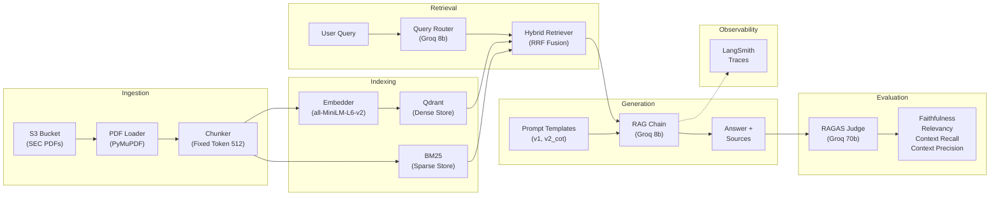

# 🔍 RAG Eval Studio

> A production-grade Retrieval-Augmented Generation pipeline with hybrid search,
> automated RAGAS evaluation, and LangSmith observability.
> Built on SEC financial filings (10-K, 10-Q) for real-world document QA.

## 🎯 Key Features

- **Hybrid Retrieval**: Dense (Qdrant) + Sparse (BM25) with Reciprocal Rank Fusion
- **3 Chunking Strategies**: Fixed-token (selected), paragraph-aware, recursive character
- **Query Routing**: Automatic complexity classification for cost optimization
- **RAGAS Evaluation**: Faithfulness, relevancy, context recall, context precision
- **LangSmith Observability**: Full trace logging for every query
- **Streamlit UI**: Interactive query interface with comparison mode
- **CI/CD Pipeline**: Automated evaluation on every push

## 🚀 Quick Start

```bash
# Clone
git clone https://github.com/SarvagyaGupta-19/rag-eval-studio.git
cd rag-eval-studio

# Setup
python -m venv .venv
.venv\Scripts\activate       # Windows
pip install -r requirements.txt

# Configure
cp .env.example .env
# Fill in your API keys in .env

# Run
make run                      # Streamlit UI
make test                     # Unit tests (23 tests)
make eval                     # RAGAS evaluation
make pipeline                 # End-to-End Pipeline test
```

## 🏗️ Architecture



## 📊 Evaluation Results — Chunking Strategy Comparison

Evaluated on 30 hand-verified QA pairs (10 factoid, 8 analytical, 7 multi-hop, 5 unanswerable) from SEC 10-K/10-Q filings of Apple, Tesla, NVIDIA, and JPMorgan.

| Metric | Fixed Token | Paragraph | Recursive Char | **Winner** |
|--------|------------|-----------|----------------|------------|
| Faithfulness | 0.4143 | 0.2857 | **0.4494** | Recursive |
| Answer Relevancy | 0.7913 | 0.7913 | 0.7913 | Tie |
| Context Recall | **0.4000** | 0.2000 | 0.2000 | **Fixed Token** |
| Context Precision | 0.6442 | 0.6842 | 0.6842 | Tie |

**Decision**: Fixed Token chunking selected — 2× higher context recall is critical for RAG accuracy. If the retriever can't find the right chunks, LLM quality is irrelevant.

## 📝 Design Decisions

| Decision | Choice | Rationale |
|----------|--------|-----------|
| Chunking | Fixed token (512) | Best context recall on financial tables; consistent embedding window |
| Retrieval | Hybrid (RRF) | Dense captures semantics, BM25 catches exact numbers and terms |
| Embedding | all-MiniLM-L6-v2 | Fast, 384-dim, good for document retrieval |
| Generator | Groq llama-3.1-8b | Fast inference; smaller than judge to maintain eval integrity |
| Judge | Groq llama-3.3-70b | Stronger model evaluates weaker model — avoids self-evaluation bias |
| Eval dataset | Hand-annotated | 30 QA pairs verified against actual PDF content; no auto-generated noise |

## 📁 Project Structure

```
rag-eval-studio/
├── app/                    # Streamlit UI
│   ├── main.py             # Main application
│   └── components/         # Reusable UI panels
├── services/               # Core pipeline
│   ├── loader.py           # PDF loading from S3
│   ├── chunker.py          # 3 chunking strategies
│   ├── embedding.py        # Sentence-transformer embeddings
│   ├── vector_store.py     # Qdrant dense retrieval
│   ├── bm25_store.py       # BM25 sparse retrieval
│   ├── hybrid_retriever.py # RRF fusion
│   ├── rag_chain.py        # LLM generation with LangSmith
│   └── query_router.py     # Query complexity classification
├── eval/                   # Evaluation framework
│   ├── ragas_eval.py       # RAGAS runner with answer caching
│   └── datasets/           # Hand-annotated QA pairs
├── scripts/                # CLI tools
│   ├── compare_chunking.py # Strategy comparison experiment
│   ├── generate_qa_dataset.py
│   ├── index_documents.py
│   └── run_pipeline.py
├── prompts/                # Versioned prompt templates
├── tests/                  # 23 unit tests
└── infra/                  # Config and S3 utilities
```

## License

MIT
